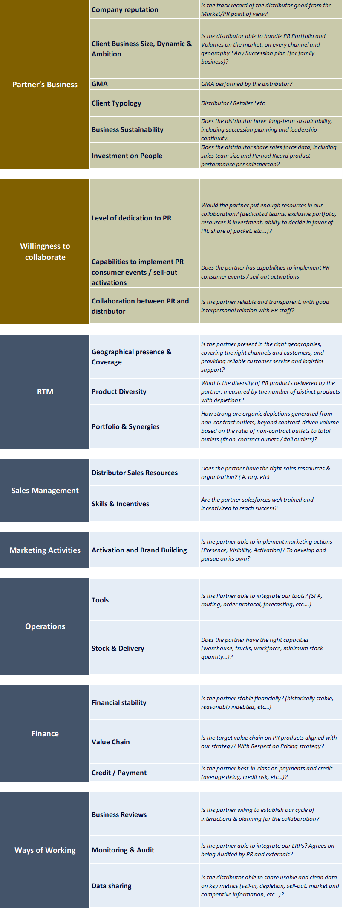
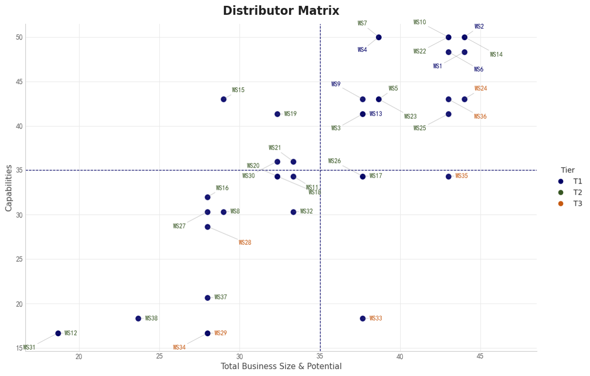

# Distributor Segmentation Matrix

A structured distributor assessment and segmentation framework designed to support incentive differentiation and strategic decision-making.

---

## Overview

This project transforms fragmented distributor evaluation into a standardized, data-driven framework by combining quantitative and qualitative criteria into a unified scoring model.

The output is a four-quadrant matrix that supports distributor segmentation, improves transparency, and enables more consistent and objective decision-making.

---

## Business Context

Distributor evaluation and incentive allocation were previously:

- based on fragmented data and subjective judgment  
- lacking a consistent and scalable evaluation framework  
- difficult to align with strategic priorities  
- not comparable across distributors  

This project was designed to establish a structured assessment approach that links distributor evaluation directly to segmentation and incentive differentiation.

---

## Assessment Framework

The distributor evaluation framework is designed to provide a structured and consistent approach to assess partner performance, capability, and strategic potential.

The model integrates multiple dimensions, including:

- Business size and growth potential  
- Willingness to collaborate and strategic alignment  
- Route-to-market structure and coverage  
- Ways of working and operational discipline  
- Execution capabilities across channels  

Each dimension is decomposed into a set of clearly defined criteria and translated into a standardized scoring model.  
Qualitative inputs are systematically structured and quantified to reduce subjectivity and ensure comparability across distributors.

The detailed criteria, scoring logic, and weighting methodology are documented in the **"Criterias assessed"** sheet.

---

## Scoring Approach

The framework converts multi-dimensional inputs into a unified scoring structure:

- Standardized scoring scales are applied across all criteria  
- Weighted aggregation reflects the relative importance of each dimension  
- Qualitative assessments are codified into measurable indicators  
- Final scores are normalized to enable cross-distributor comparison  

This ensures that evaluation is transparent, repeatable, and aligned with business priorities.

---

## Segmentation Logic

The aggregated scores are mapped into a two-dimensional matrix:

- **X-axis**: Business size and potential  
- **Y-axis**: Capability and execution strength  

Distributors are segmented into four strategic groups:

- High potential / High capability → Strategic partners  
- High potential / Low capability → Development focus  
- Low potential / High capability → Efficiency optimization  
- Low potential / Low capability → Maintain or review  

This segmentation provides a clear and actionable framework for aligning incentive allocation with strategic priorities.

---

## Data & Files

- **Excel Workbook**
  - `Criterias assessed` → detailed criteria and scoring methodology  
  - `Assessment Distributor` → structured scoring and evaluation logic  
  - `Distributor Matrix` → final scoring results and segmentation  

- **Python Script**
  - used to generate the four-quadrant visualization  

---

## Methodology Summary

This project demonstrates how:

- qualitative and quantitative inputs can be unified into a structured evaluation model  
- subjective assessments can be standardized into measurable scoring logic  
- distributor comparison can be made consistent and scalable  
- segmentation outputs can directly support strategic decision-making  

---

## My Role

- Designed the end-to-end distributor assessment framework  
- Structured qualitative and quantitative criteria into a standardized scoring model  
- Translated business evaluation logic into data-driven methodology  
- Developed Python-based visualization for segmentation output  
- Facilitated alignment with commercial stakeholders for practical adoption  

---

## Tech Stack

Python · Pandas · Data Visualization · Excel  

---

## Notes

All data in this repository is anonymized and does not represent actual business data.

The framework is designed to be scalable and can be extended into control tower environments for ongoing performance monitoring.
